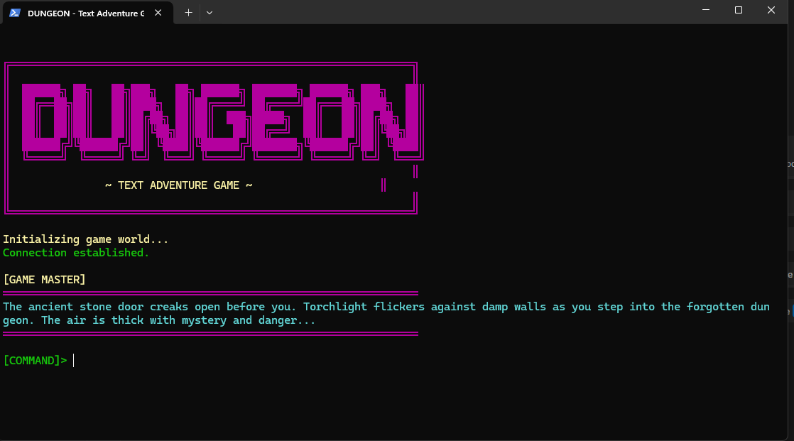

# DUNGEON - Text Adventure Game

A retro-style text adventure game powered by LangGraph and Ollama AI.



## Overview

**DUNGEON** is an immersive text-based adventure game where players explore a mysterious dungeon by typing natural language commands. An AI Game Master creates atmospheric scenes and responds to player actions in real-time.

## Features

-  **AI-Powered Storytelling**: Dynamic narrative using Ollama LLM
-  **Retro Terminal UI**: ASCII art, colors, and typewriter effects  
-  **Natural Language Commands**: Type actions in plain English
-  **Persistent Context**: AI remembers entire game history
-  **Real-time Responses**: Instant AI-generated adventures

## Architecture

### Core Components
- **GameState**: Manages game history, user input, and AI responses
- **LangGraph Workflow**: Single-node graph for processing game turns
- **Ollama LLM**: AI brain generating atmospheric dungeon master responses

### System Flow
```
Player Input → LangGraph → Ollama AI → Game Response → Updated State
```

## Installation

1. **Install Ollama**: Download from [ollama.ai](https://ollama.ai)

2. **Install Python dependencies**:
   ```bash
   pip install langgraph langchain-ollama langchain-core
   ```

3. **Pull the AI model**:
   ```bash
   ollama pull llama3:latest
   ```

4. **Clone and run**:
   ```bash
   git clone https://github.com/VasilisKollio/Text-Adventure-Game-Langgraph-Ollama.git
   cd Text-Adventure-Game-Langgraph-Ollama
   python text-adventure-game/setup.py
   ```

## How to Play

### Game Commands
- **Actions**: `go north`, `examine door`, `attack goblin`, `pick up sword`
- **Special Commands**:
  - `help` - Show available commands
  - `clear` - Clear screen and redisplay banner
  - `exit`/`quit`/`q` - End game session

### Gameplay Tips
- Use descriptive natural language
- The AI remembers your entire journey
- Explore thoroughly - there are hidden secrets!
- Be creative with your commands

## Technical Details

### GameState Structure
```python
class GameState(TypedDict):
    history: str      # Complete conversation history
    user_input: str   # Current player command  
    response: str     # AI-generated response
```

### AI Configuration
The game master AI is prompted to:
- Create atmospheric dungeon scenarios
- Provide vivid 2-4 sentence descriptions
- Maintain consistent fantasy atmosphere
- Always prompt for the next player action

## Requirements

- **Python**: 3.8 or higher
- **Memory**: 4GB+ RAM (for AI model)
- **Terminal**: ANSI color support
- **Storage**: 2GB+ free space (for Ollama model)

## Screenshot

The game features a retro terminal interface with:
- ASCII art title banner
- Colored text output
- Typewriter text effects
- Atmospheric game descriptions

## Contributing

Feel free to fork this repository and submit pull requests for improvements!

## License

This project is open source and available under the MIT License.